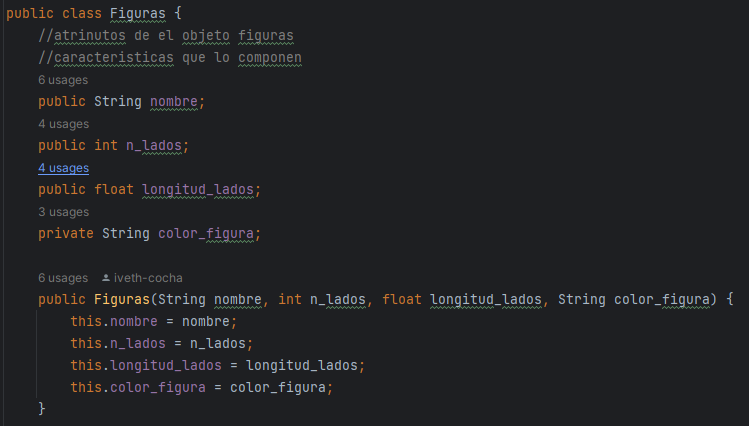
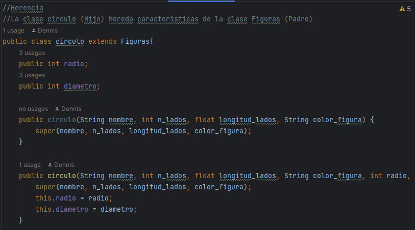
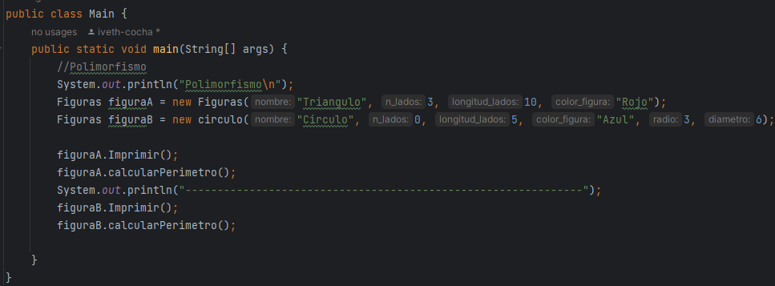
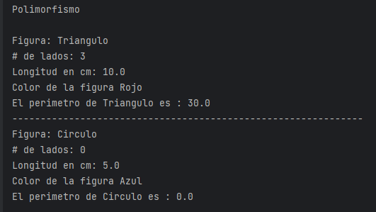

# Pilares-de-POO
Inegrantes:  
Dennis Cataña  
Iveth Cocha
* Abstracción:Podemos representar un objeto del mundo real mediante la programación y para ello se requiere definir un objeto en función de sus atributos/características y métodos; la abstracción se basa en simplificar el número de atributos y metodos en los más esenciales y en función de ellos mostrar solo lo más relevante. En el ejemplo se utiliza la clase Figuras como una generalidad de todas las figuras existentes, pero para disminuir la cantidad d figuras en las nos centramos en el nombre de la figura,el número de lados que posee, la longitud de sus lados y también establecemos un método. 
 
 
 
 Al momento de instanciar un objeto debe cumplir con las características establecidas en nuestra clase Figuras, junto con el método de CalcularPerimetro 
    
 
* Encapsulamiento: El encapsulamiento restringe el acceso desde otra clase hacia un método o atributo, para crear esta restricción solo de debe cambiar la palabra public por private o protectec con esto estamos indicando al programa de que no voy a poder acceder a ellos desde otra clase, como consecuencia las acciones que desempeñe no podrán ser alteradas/modificadas externamente.  
    
 
* Herencia: Es el mecanismo por el cual una clase permite heredar las características (atributos y métodos) de otra clase. La herencia permite que se puedan definir nuevas clases basadas de unas ya existentes a fin de reutilizar el código, generando así una jerarquía de clases dentro de una aplicación 
 
 
 

* Polimorfismo: Permite a los objetos de diferentes clases ser tratados como si fueran del mismo tipo. En otras palabras, un objeto puede tomar muchas formas o comportarse de diferentes maneras dependiendo del contexto en el que se utilice.
 

 

